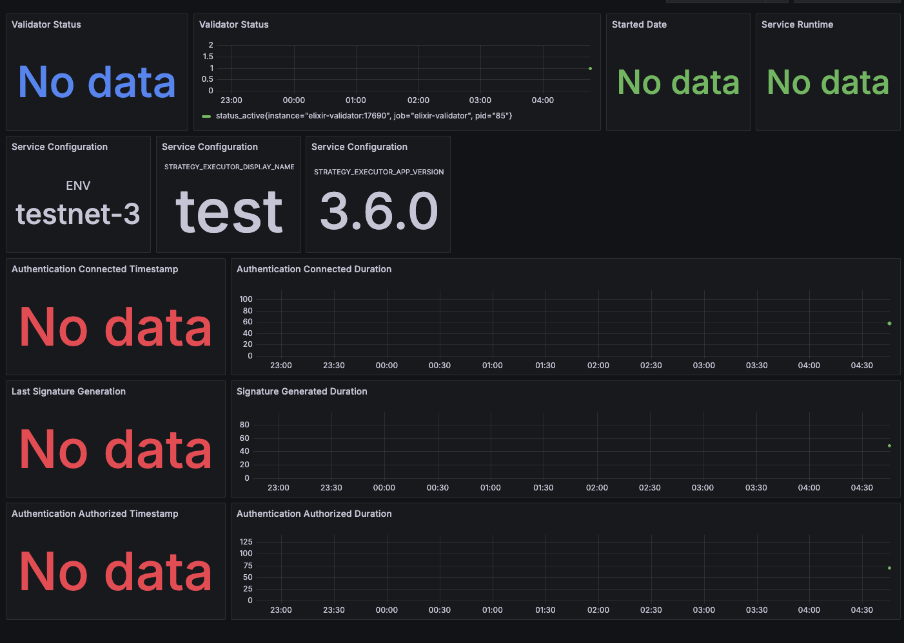

## quick start

prepare for grafana

```bash
cp grafana/.env.example grafana/.env
```

then, fill grafana/.env

prepare for elixir validator

```bash
# fetch validator.env
curl -s https://files.elixir.finance/validator.env -o elixir/.env
```

fill out it

see https://docs.elixir.xyz/running-an-elixir-validator#download-the-environment-template for detail

next, start docker compose

```bash
docker compose up -d
```

if start is success, you can login http://localhost:3000/

For the username, enter admin, and for the password, enter the value set in GF_SECURITY_ADMIN_PASSWORD


There is a pre-configured dashboard (Elixir Validator), so you can view the dashboard by clicking on it


When you first launch it, “No data” will be displayed, but after a few minutes, the data will appear


